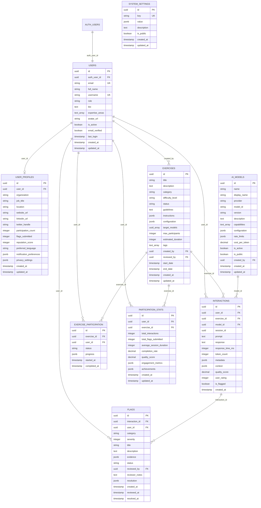

# SOMOS Civic Lab Database Schema Documentation

## 🗄️ Database Overview

The SOMOS Civic Lab platform uses PostgreSQL via Supabase with a comprehensive schema designed for AI red-teaming exercises, user management, and community engagement.

### Key Features
- **Multi-tenant security** with Row Level Security (RLS)
- **Scalable UUID primary keys** for distributed systems
- **Audit trails** with automatic timestamps
- **Flexible JSON configurations** for extensibility
- **Performance optimized** with strategic indexes

## 📊 Entity Relationship Diagram



## 📋 Table Specifications

### 1. Users Table
**Purpose:** Core user accounts linked to Supabase Auth

| Column | Type | Constraints | Description |
|--------|------|-------------|-------------|
| id | UUID | PRIMARY KEY | Unique user identifier |
| auth_user_id | UUID | FOREIGN KEY, UNIQUE | Links to Supabase auth.users |
| email | VARCHAR(255) | UNIQUE, NOT NULL | User email address |
| full_name | VARCHAR(255) | | User's full name |
| username | VARCHAR(50) | UNIQUE | Unique username |
| role | VARCHAR(20) | CHECK IN ('admin', 'participant', 'moderator') | User role |
| bio | TEXT | | User biography |
| expertise_areas | TEXT[] | | Array of expertise areas |
| avatar_url | TEXT | | Profile picture URL |
| is_active | BOOLEAN | DEFAULT true | Account status |
| email_verified | BOOLEAN | DEFAULT false | Email verification status |

### 2. AI Models Table
**Purpose:** Multi-provider AI model configurations

| Column | Type | Constraints | Description |
|--------|------|-------------|-------------|
| id | UUID | PRIMARY KEY | Unique model identifier |
| name | VARCHAR(255) | NOT NULL | Actual model name |
| display_name | VARCHAR(255) | NOT NULL | Anonymized name for blind testing |
| provider | VARCHAR(50) | CHECK IN ('openai', 'anthropic', 'google', 'custom', 'local') | AI provider |
| model_id | VARCHAR(255) | NOT NULL | Provider-specific model ID |
| configuration | JSONB | DEFAULT '{}' | Provider-specific settings |
| rate_limits | JSONB | DEFAULT '{}' | Rate limiting configuration |
| is_active | BOOLEAN | DEFAULT true | Model availability |
| is_public | BOOLEAN | DEFAULT true | Public visibility |

### 3. Exercises Table
**Purpose:** Red-teaming exercise definitions

| Column | Type | Constraints | Description |
|--------|------|-------------|-------------|
| id | UUID | PRIMARY KEY | Unique exercise identifier |
| title | VARCHAR(255) | NOT NULL | Exercise title |
| description | TEXT | NOT NULL | Exercise description |
| category | VARCHAR(100) | NOT NULL | Exercise category |
| difficulty_level | VARCHAR(20) | CHECK IN ('beginner', 'intermediate', 'advanced') | Difficulty level |
| status | VARCHAR(20) | CHECK IN ('draft', 'active', 'paused', 'completed', 'archived') | Exercise status |
| guidelines | TEXT | NOT NULL | Exercise guidelines |
| instructions | JSONB | NOT NULL | Structured instructions |
| target_models | UUID[] | | Array of target AI model IDs |
| max_participants | INTEGER | | Maximum participants |

### 4. Interactions Table
**Purpose:** User-AI interaction records

| Column | Type | Constraints | Description |
|--------|------|-------------|-------------|
| id | UUID | PRIMARY KEY | Unique interaction identifier |
| user_id | UUID | FOREIGN KEY | User who made the interaction |
| exercise_id | UUID | FOREIGN KEY | Associated exercise |
| model_id | UUID | FOREIGN KEY | AI model used |
| session_id | UUID | NOT NULL | Groups related interactions |
| prompt | TEXT | NOT NULL | User's input prompt |
| response | TEXT | | AI model's response |
| response_time_ms | INTEGER | | Response time in milliseconds |
| token_count | INTEGER | | Number of tokens used |
| metadata | JSONB | DEFAULT '{}' | Model-specific metadata |
| quality_score | DECIMAL(3,2) | | Quality score (0.00-5.00) |
| user_rating | INTEGER | CHECK 1-5 | User's rating of response |
| is_flagged | BOOLEAN | DEFAULT false | Flag status |

### 5. Flags Table
**Purpose:** Issue reporting system

| Column | Type | Constraints | Description |
|--------|------|-------------|-------------|
| id | UUID | PRIMARY KEY | Unique flag identifier |
| interaction_id | UUID | FOREIGN KEY | Flagged interaction |
| user_id | UUID | FOREIGN KEY | User who submitted flag |
| category | VARCHAR(50) | CHECK (predefined categories) | Flag category |
| severity | INTEGER | CHECK 1-10 | Severity level |
| title | VARCHAR(255) | NOT NULL | Flag title |
| description | TEXT | NOT NULL | Detailed description |
| evidence | JSONB | DEFAULT '{}' | Supporting evidence |
| status | VARCHAR(20) | CHECK IN ('pending', 'under_review', 'resolved', 'dismissed') | Review status |
| reviewed_by | UUID | FOREIGN KEY | Reviewing moderator |

## 🔐 Security Implementation

### Row Level Security (RLS) Policies

#### User Data Protection
- Users can only access their own profile data
- Admins have full access to user management
- Public profiles are visible to all authenticated users

#### Exercise Access Control
- Active exercises are visible to all participants
- Draft exercises only visible to creators and admins
- Exercise management restricted to admins

#### Interaction Privacy
- Users can only view their own interactions
- Moderators can access interactions for review purposes
- Interaction creation restricted to authenticated users

#### Flag Moderation
- Users can view and manage their own flags
- Moderators can review and resolve all flags
- Flag creation requires authentication

### Authentication Integration
- Seamless integration with Supabase Auth
- JWT-based session management
- Role-based access control (RBAC)

## 🚀 Performance Optimizations

### Strategic Indexing
```sql
-- High-frequency query indexes
CREATE INDEX idx_interactions_user_exercise ON interactions(user_id, exercise_id);
CREATE INDEX idx_flags_status_severity ON flags(status, severity);
CREATE INDEX idx_exercises_status_category ON exercises(status, category);
```

### Query Optimization
- Composite indexes for common query patterns
- Partial indexes for filtered queries
- Foreign key indexes for join performance

### Scalability Features
- UUID primary keys for distributed systems
- JSONB for flexible schema evolution
- Efficient pagination support

## 📈 Analytics and Reporting

### Built-in Analytics Tables
- **participation_stats**: User engagement metrics
- **system_settings**: Configuration and feature flags
- **interactions**: Detailed interaction tracking

### Reporting Capabilities
- User participation trends
- Exercise completion rates
- AI model performance metrics
- Flag resolution statistics
- Quality score analytics

## 🔧 Maintenance and Operations

### Automated Maintenance
- Automatic timestamp updates via triggers
- Data integrity enforcement via constraints
- Cascade deletes for data consistency

### Backup and Recovery
- Point-in-time recovery support
- Automated daily backups via Supabase
- Data export capabilities for compliance

### Monitoring
- Query performance tracking
- Storage usage monitoring
- Connection pool management

## 📚 Usage Examples

### Creating a New Exercise
```sql
INSERT INTO exercises (title, description, category, difficulty_level, guidelines, instructions, created_by)
VALUES (
  'Election Information Testing',
  'Test AI responses about voting procedures and candidate information',
  'Civic Information',
  'beginner',
  'Verify factual accuracy and identify partisan bias',
  '{"steps": ["Ask about voting procedures", "Test candidate information", "Check for bias"]}',
  (SELECT id FROM users WHERE email = 'admin@somos.website')
);
```

### Recording an Interaction
```sql
INSERT INTO interactions (user_id, exercise_id, model_id, session_id, prompt, response, response_time_ms)
VALUES (
  (SELECT id FROM users WHERE auth_user_id = auth.uid()),
  'exercise-uuid',
  'model-uuid',
  'session-uuid',
  'How do I register to vote?',
  'To register to vote, you need to...',
  1250
);
```

### Submitting a Flag
```sql
INSERT INTO flags (interaction_id, user_id, category, severity, title, description)
VALUES (
  'interaction-uuid',
  (SELECT id FROM users WHERE auth_user_id = auth.uid()),
  'misinformation',
  7,
  'Incorrect voting deadline information',
  'The AI provided an incorrect voter registration deadline for this state.'
);
```

## 🔄 Migration and Updates

### Schema Versioning
- All schema changes tracked in migration files
- Backward compatibility maintained
- Rollback procedures documented

### Data Migration
- Safe migration procedures for production
- Data validation after migrations
- Performance impact assessment

---

**Database Version:** 1.0  
**Last Updated:** Week 1 - Foundation Phase  
**Supabase Project:** https://barcrmxjgisydxjtnolv.supabase.co
