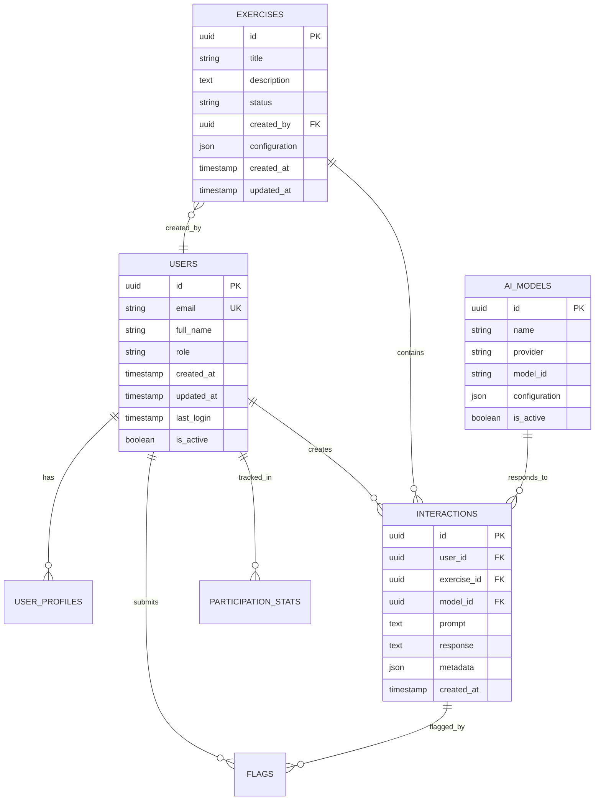

# SOMOS Civic Lab - Technical Architecture Overview

**Version:** 1.0  
**Last Updated:** Week 1 Foundation Phase  
**Architecture Type:** Modern Full-Stack Web Application

## 🏗 System Architecture

### High-Level Architecture Diagram

## 🎯 Architecture Principles

### 1. **Serverless-First**
- Static site generation for optimal performance
- Serverless functions for dynamic operations
- Edge computing for global distribution

### 2. **Security by Design**
- Row Level Security (RLS) for data protection
- JWT-based authentication
- API rate limiting and abuse prevention

### 3. **Scalable & Performant**
- CDN distribution via Netlify
- Database connection pooling
- Optimized bundle splitting

### 4. **Developer Experience**
- TypeScript for type safety
- Hot reload development
- Automated testing and deployment

## 🔧 Technology Stack

### Frontend Layer
| Component | Technology | Version | Purpose |
|-----------|------------|---------|---------|
| **Framework** | Next.js | 16.x | React framework with SSG/SSR |
| **Language** | TypeScript | 5.x | Type-safe JavaScript |
| **Styling** | Tailwind CSS | 4.x | Utility-first CSS framework |
| **UI Components** | Radix UI | Latest | Accessible component primitives |
| **Icons** | Lucide React | Latest | Consistent icon library |
| **State Management** | React Context | Built-in | Global state management |

### Backend Layer
| Component | Technology | Version | Purpose |
|-----------|------------|---------|---------|
| **Database** | PostgreSQL | 15+ | Primary data storage |
| **BaaS** | Supabase | Latest | Backend-as-a-Service |
| **Authentication** | Supabase Auth | Latest | User authentication & authorization |
| **Real-time** | Supabase Realtime | Latest | Live data synchronization |
| **Storage** | Supabase Storage | Latest | File and media storage |

### AI Integration Layer
| Provider | API | Purpose | Integration Status |
|----------|-----|---------|-------------------|
| **OpenAI** | GPT-4, GPT-3.5 | Primary AI models | Planned Week 7 |
| **Anthropic** | Claude 3 | Alternative AI provider | Planned Week 7 |
| **Google** | Gemini | Multi-modal AI | Planned Week 7 |
| **Custom** | Local/Private models | Specialized testing | Planned Week 8 |

### Infrastructure Layer
| Component | Service | Purpose | Status |
|-----------|---------|---------|--------|
| **Hosting** | Netlify | Static site hosting | ✅ Active |
| **CI/CD** | GitHub Actions | Automated deployment | ✅ Active |
| **DNS** | Netlify DNS | Domain management | Planned |
| **Monitoring** | Netlify Analytics | Performance tracking | Planned |
| **Error Tracking** | Sentry | Error monitoring | Planned Week 10 |

## 📊 Data Architecture

### Database Schema Overview

### Data Flow Architecture

## 🔐 Security Architecture

### Authentication Flow

### Security Layers

1. **Transport Security**
   - HTTPS/TLS encryption
   - Secure cookie handling
   - CORS configuration

2. **Authentication Security**
   - JWT token validation
   - Session management
   - Password hashing (bcrypt)

3. **Authorization Security**
   - Row Level Security (RLS)
   - Role-based access control
   - API rate limiting

4. **Data Security**
   - Input validation and sanitization
   - SQL injection prevention
   - XSS protection

## 🚀 Performance Architecture

### Frontend Optimization
- **Static Site Generation (SSG):** Pre-built pages for optimal loading
- **Code Splitting:** Lazy loading of components and routes
- **Image Optimization:** Next.js Image component with WebP support
- **Bundle Analysis:** Webpack bundle analyzer for size optimization

### Backend Optimization
- **Connection Pooling:** Supabase handles database connections
- **Query Optimization:** Indexed database queries
- **Caching Strategy:** Browser caching and CDN caching
- **Real-time Optimization:** Selective real-time subscriptions

### CDN & Caching Strategy

## 🔄 Development Architecture

### Development Workflow

### Environment Strategy
| Environment | Purpose | URL | Deployment |
|-------------|---------|-----|------------|
| **Development** | Local development | localhost:3000 | Manual |
| **Preview** | PR testing | netlify-preview.app | Automatic |
| **Production** | Live application | somos-civiclab.app | Automatic |

### Code Quality Architecture
- **TypeScript:** Compile-time type checking
- **ESLint:** Code linting and style enforcement
- **Prettier:** Code formatting consistency
- **Husky:** Git hooks for quality gates
- **Jest:** Unit testing framework (planned)
- **Playwright:** E2E testing framework (planned)

## 📈 Scalability Architecture

### Horizontal Scaling Strategy
1. **Frontend Scaling**
   - CDN distribution (Netlify)
   - Static asset optimization
   - Progressive loading

2. **Backend Scaling**
   - Supabase auto-scaling
   - Connection pooling
   - Read replicas (if needed)

3. **AI API Scaling**
   - Rate limiting per provider
   - Fallback provider strategy
   - Request queuing system

### Performance Monitoring
- **Core Web Vitals:** LCP, FID, CLS tracking
- **Database Performance:** Query execution time
- **API Response Times:** AI provider latency
- **Error Rates:** Application error tracking

## 🔮 Future Architecture Considerations

### Planned Enhancements (Weeks 7-10)
1. **Microservices Migration**
   - AI service abstraction
   - Analytics service separation
   - Moderation service isolation

2. **Advanced Caching**
   - Redis for session storage
   - AI response caching
   - Database query caching

3. **Real-time Features**
   - Live collaboration
   - Real-time notifications
   - Live exercise participation

4. **Analytics Architecture**
   - Event tracking system
   - Data warehouse integration
   - Business intelligence dashboard

## 📋 Architecture Decision Records (ADRs)

### ADR-001: Next.js Framework Selection
**Decision:** Use Next.js 16 with App Router  
**Rationale:** SSG capabilities, TypeScript support, excellent developer experience  
**Status:** ✅ Implemented

### ADR-002: Supabase as Backend Service
**Decision:** Use Supabase for database and authentication  
**Rationale:** PostgreSQL compatibility, built-in auth, real-time capabilities  
**Status:** 🔄 In Progress

### ADR-003: Netlify for Hosting
**Decision:** Use Netlify with GitHub Actions for deployment  
**Rationale:** Cost efficiency, team collaboration, excellent performance  
**Status:** ✅ Implemented

### ADR-004: Static Export Strategy
**Decision:** Use Next.js static export for production builds  
**Rationale:** Optimal performance, CDN compatibility, cost efficiency  
**Status:** ✅ Implemented

---

## 🎯 Architecture Success Metrics

### Performance Targets
- **Page Load Time:** < 2 seconds
- **Time to Interactive:** < 3 seconds
- **Lighthouse Score:** > 90
- **Core Web Vitals:** All green

### Scalability Targets
- **Concurrent Users:** 1,000+
- **Database Queries:** < 100ms average
- **API Response Time:** < 500ms
- **Uptime:** 99.9%

### Security Targets
- **Zero Critical Vulnerabilities**
- **OWASP Compliance**
- **Data Encryption:** At rest and in transit
- **Authentication:** Multi-factor support

---

*This architecture provides a solid foundation for the SOMOS Civic Lab platform, balancing performance, security, scalability, and developer experience while maintaining cost efficiency.*
